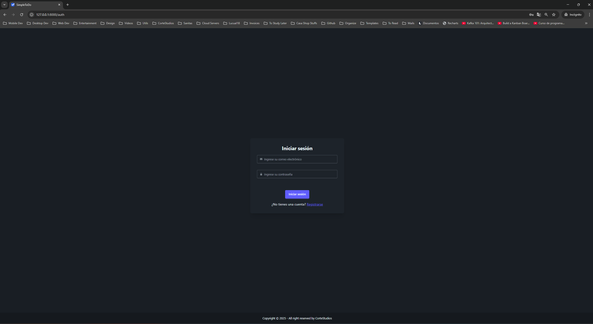
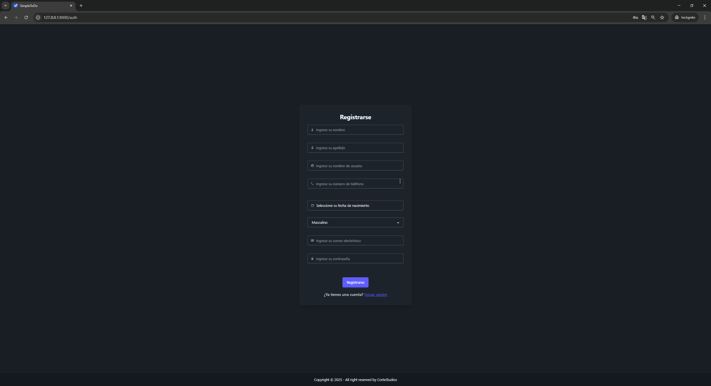
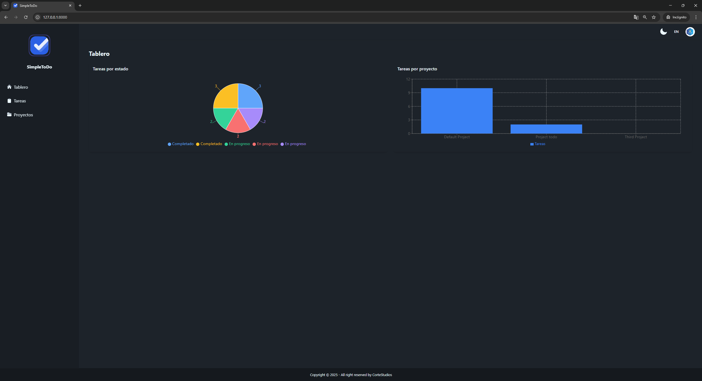
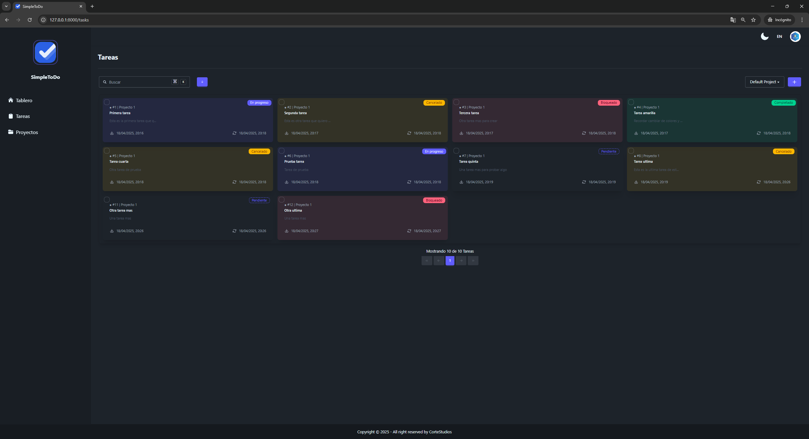
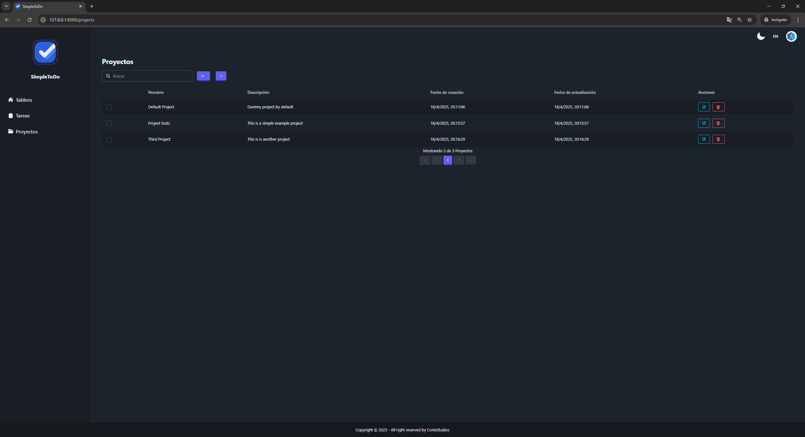
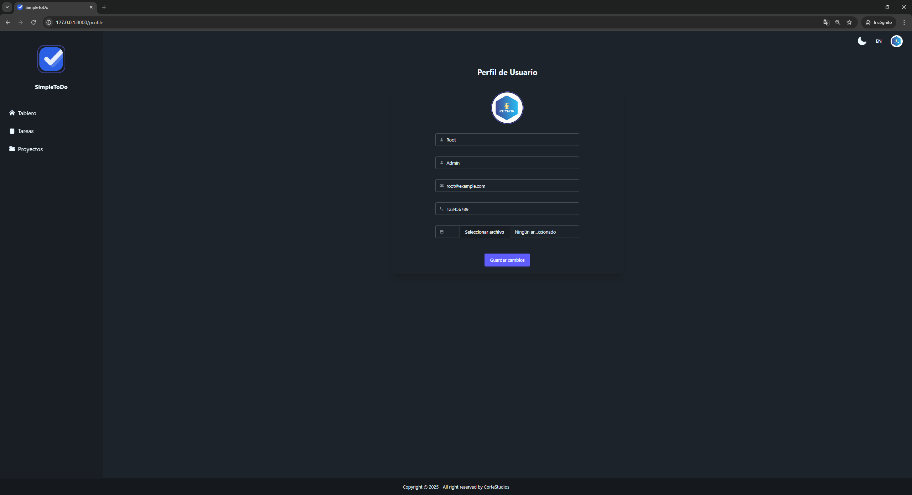
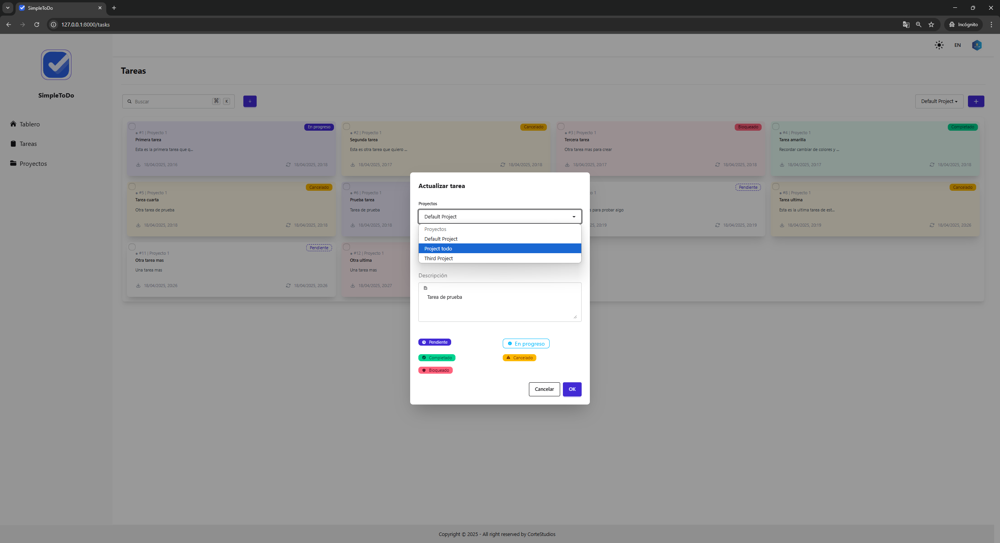
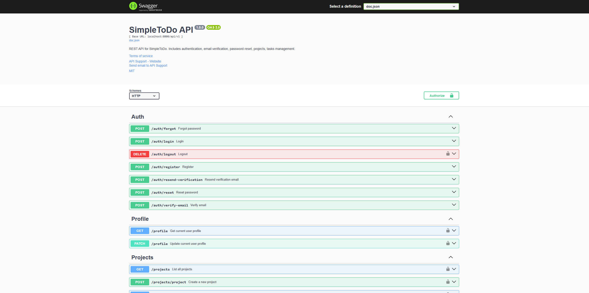
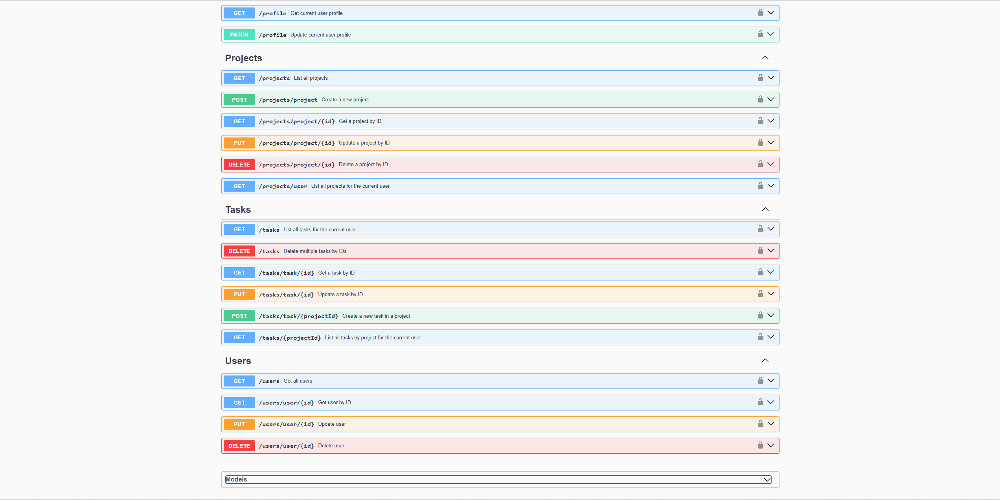
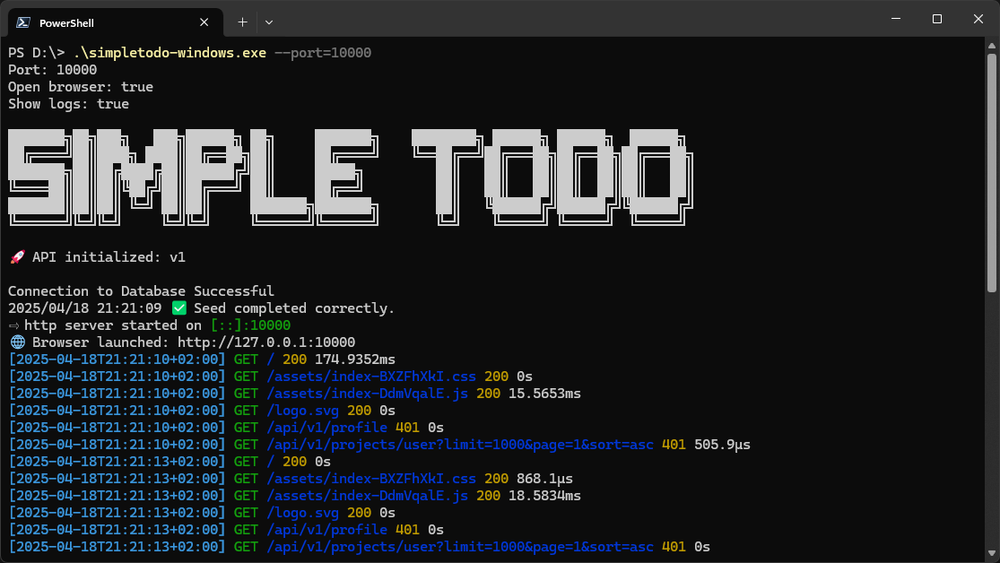

# SimpleToDo

SimpleToDo is a fullstack task management application, where users can create, edit, organize, and drag tasks between
columns based on their status (pending, ongoing, completed, etc).

It consists of:

- A **React + TypeScript frontend**, using `@dnd-kit` for drag-and-drop functionality and `react-i18next` for
  internationalization.
- A **Go backend**, exposing a secure and efficient REST API with JWT authentication, advanced pagination, and modular
  business logic.
- The frontend is embedded inside the Go binary using `embed`, allowing for a simplified deployment as a standalone
  executable.

---

## 📂 Project Structure

```
├───.github
│   └───workflows
├───app
├───config
│   └───static
│       └───templates
├───db
├───docs
├───dto
│   ├───request
│   └───response
├───frontend
│   ├───dist
│   │   └───assets
│   ├───public
│   └───src
│       ├───assets
│       │   └───lottie
│       ├───components
│       ├───hooks
│       ├───i18n
│       │   └───locales
│       ├───pages
│       ├───schemas
│       ├───services
│       ├───store
│       └───utils
├───middleware
├───models
├───repository
├───router
│   └───v1
├───service
└───util
    ├───mailer
    └───mapper
```

---

## 🚀 Build & Run Locally

### 1. Build the backend

```bash
go build -o todoapp ./app
```

### 2. (Optional) Regenerate Swagger Documentation

```bash
swag init -d "./app,./router/v1,./dto/request,./dto/response" -o docs --parseDependency --parseDependencyLevel 3 --parseFuncBody
```

### 3. Run the app

```bash
./todoapp
```

---

## 📖 API Documentation (Swagger)

After running the app, open in your browser:

```
http://localhost:8000/swagger/index.html#/
```

> Replace `localhost:8000` with your actual host and port if different.

---

## ⚙️ Environment Configuration

The application now uses **environment variables** stored in `.env`.  
By default, both `.env` and the SQLite database will be located under:

```
$SIMPLETODO_HOME
```

If not set, it defaults to:

```
~/SimpleToDo
```

### Example `.env`

```env
JWT_SECRET=your-secret-key
SCHEME=http
HOST=localhost
PORT=8000
BASE_URL=http://localhost:8000
OPEN_BROWSER=true
SHOW_LOGS=true
CORS_ORIGIN=http://localhost:3000

SMTP_HOST=smtp.example.com
SMTP_PORT=587
SMTP_USER=user
SMTP_PASSWORD=pass
SMTP_FROM_EMAIL=app@example.com

ROOT_FIRSTNAME=Admin
ROOT_LASTNAME=User
ROOT_PHONE=+123456789
ROOT_EMAIL=admin@example.com
ROOT_USERNAME=admin
ROOT_PASSWORD=changeme
```

> ⚠️ If values are missing, on first run you’ll be prompted interactively to fill them.  
> Simply pressing **Enter** will use safe defaults (where possible) so you can quickly try the app without full SMTP
> configuration.

---

## 🐳 Run with Docker Compose

A ready-to-use **docker-compose.yml** is provided:

```yaml
services:
  app:
    build: .
    container_name: simpletodo
    ports:
      - "8000:8000"
    env_file:
      - .env # Ensure this file exists in the same directory
    volumes:
      - ./data:/data
    restart: unless-stopped
```

### Steps:

1. Create a `.env` file (or copy an existing one) into `./my-app.env`.
2. Run:
   ```bash
   docker-compose up -d
   ```
3. Visit:  
   [http://localhost:8000](http://localhost:8000)

---

## 📦 Versioning

- Current version: **1.0.3**
- Next release: will likely be **2.0.0** due to recent breaking changes.

### Tagging a Release

```bash
git tag v2.0.0
git push origin v2.0.0
```

---

## ⚡ CI/CD

- The repository includes **GitHub Actions** under `.github/workflows`.
- On each push or tag:
    - The project is built for **Linux, Windows, and macOS**.
    - Artifacts are attached to the GitHub Release.

---


## ✨ Key Features

- JWT-based authentication
- User, project, and task management
- Dynamic filtering and advanced pagination
- Clean and responsive UI using Tailwind and Heroicons
- Cross-platform binaries built automatically with CI/CD
- Ready-to-use Docker Compose setup

---


## 🌟 SimpleToDo Images

|  |  |  |  |  |
|------------------------------------------------------------|------------------------------------------------------------------|--------------------------------------------------------------------|------------------------------------------------------------------|--------------------------------------------------------------------|
|  |  |  |  |  |


----

Ready to organize your tasks in a fast and elegant way? 🚀
