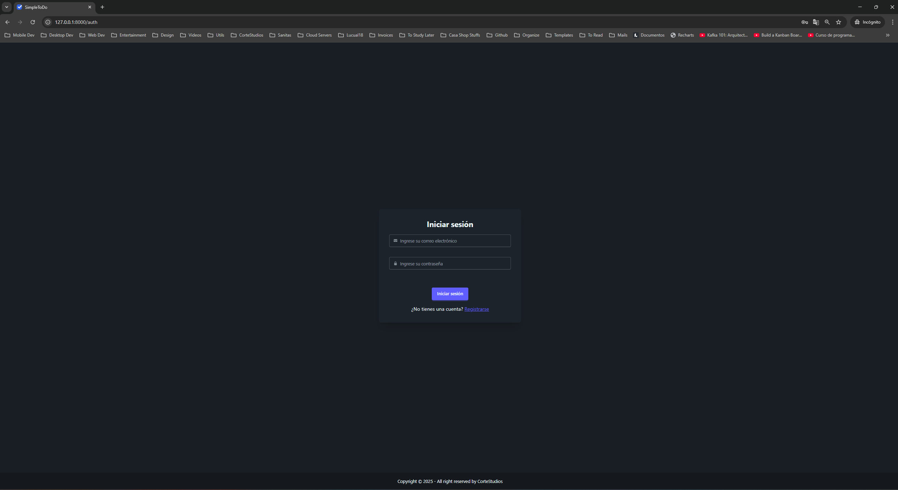
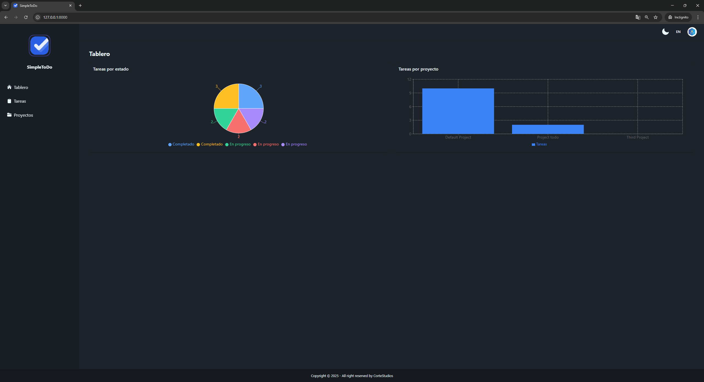
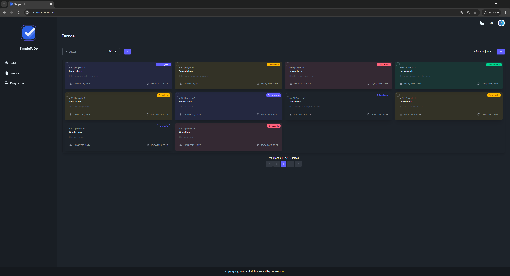
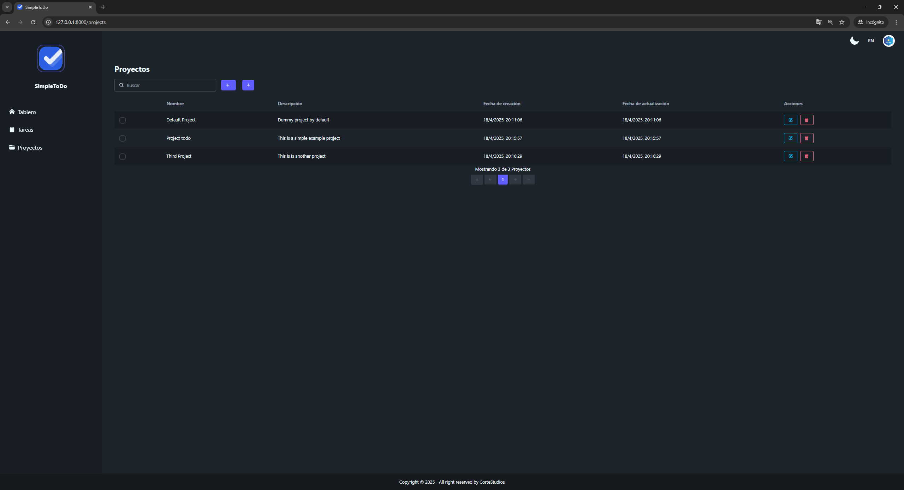
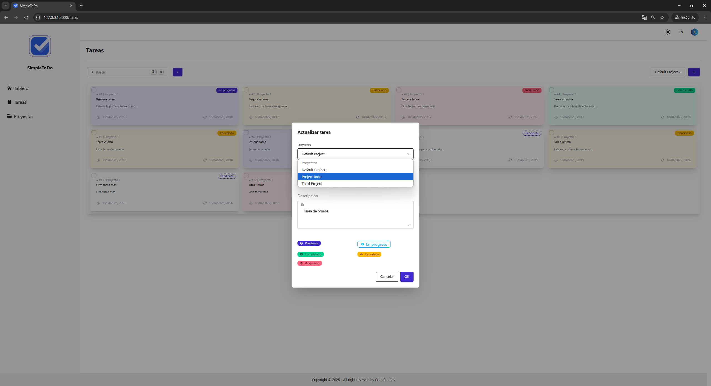
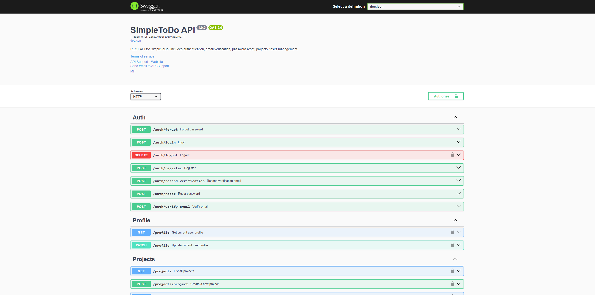
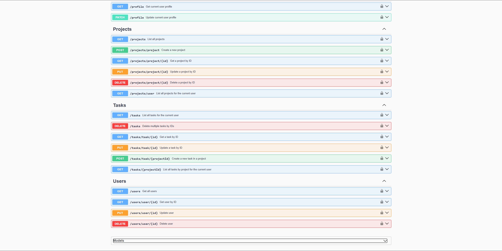
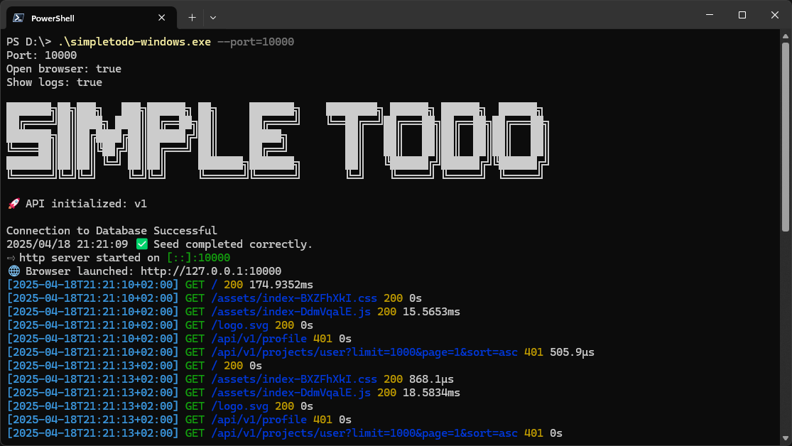

# SimpleToDo

SimpleToDo is a fullstack task management application, where users can create, edit, organize, and drag tasks between
columns based on their status (pending, ongoing, completed, etc).

Future product work is tracked in the [roadmap](docs/roadmap.md).

It consists of:

- A **React + TypeScript frontend**, using `@dnd-kit` for drag-and-drop functionality and `react-i18next` for
  internationalization.
- A **Go backend**, exposing a secure and efficient REST API with **JWT authentication stored in HTTP-only cookies**,
  advanced pagination, and modular business logic.
- The frontend is embedded inside the Go binary using `embed`, allowing for a simplified deployment as a standalone
  executable.

---

## 🔐 Authentication Model (JWT + HTTP-only Cookie)

The application uses **JWT** for authentication, but instead of sending the token in an `Authorization` header and
storing it in `localStorage`, the backend now issues a **HTTP-only cookie** that the browser sends automatically.

High-level flow:

1. **Login**
   - `POST /api/v1/auth/login` with email/password.
   - On success, the backend signs a JWT and sets it in a cookie named `auth_token`:
     - `HttpOnly: true` (not accessible from JavaScript).
     - `SameSite: Lax`.
     - `Secure` automatically enabled when `BASE_URL` uses HTTPS.
   - API clients receive the JWT in the response; the web frontend relies only on the HTTP-only cookie.

2. **Subsequent requests**
   - The frontend Axios client is configured with `withCredentials: true`.
   - The browser automatically sends `auth_token` on every request to the API origin.
   - Protected routes in the backend use a `JWTMiddleware` that reads the token from the cookie, validates it, and
     injects `user_id`, `user_email` and `user_role` into the Echo context.

3. **Current user session**
   - Frontend calls `GET /api/v1/auth/me` to retrieve basic information about the logged-in user.
   - This route is protected by the same JWT middleware and responds with `401` when the cookie is missing or invalid.
   - The React app stores the result in a lightweight `authStore` (Zustand) with fields like `isAuthenticated`, `user`
     and `isLoading`.

4. **Route protection on the frontend**
   - `PrivateRoute` and `PublicRoute` components consult `authStore` instead of reading tokens from `localStorage`.
   - `AdminRoute` checks the `role` field from `authStore.user` to allow or block access to admin-only sections.

5. **Logout**
   - `DELETE /api/v1/auth/logout` clears the cookie on the server by sending an expired `auth_token` cookie.
   - The frontend clears the auth store and redirects the user to the login page.

6. **Token expiration**
   - The JWT includes an `exp` claim (currently 72 hours by default).
   - When expired or invalid, the JWT middleware returns `401` for any protected route, and the frontend reacts by
     clearing the session and redirecting to `/auth` via the route guards.

### Google sign-in

Google authentication uses the server-side OpenID Connect authorization-code flow. The browser starts at
`GET /api/v1/auth/oauth/google`, Google returns to `GET /api/v1/auth/oauth/google/callback`, and the backend validates a
short-lived HTTP-only `state` cookie before accepting the response. Only the stable Google subject is stored; Google
access and refresh tokens are not persisted.

Create a Google OAuth client of type **Web application** and register this exact local redirect URI:

```text
http://localhost:8000/api/v1/auth/oauth/google/callback
```

For production, register `<BASE_URL>/api/v1/auth/oauth/google/callback` and use HTTPS. Set both
`GOOGLE_CLIENT_ID` and `GOOGLE_CLIENT_SECRET`; when either is missing, Google authentication remains disabled and the
frontend hides its button. Never commit the client secret.

Google accounts follow the same SimpleTodo email-verification policy as password accounts. A new account receives no
session until it verifies the application email. Unverified non-admin accounts are permanently deleted seven days
after registration; verification links last 24 hours and can be requested again during that period.

---

## 📂 Project Structure

```text
├── api/                 # Generated Swagger files
├── assets/              # Embedded application assets and documentation images
├── cmd/app/             # Go executable entry point
├── deployments/         # Dockerfile and Compose definition
├── internal/            # Backend application, DTOs, routes, services and repositories
│   └── app/webdist/     # Frontend bundle synchronized for go:embed
├── web/                 # React, TypeScript and Vite application
├── embed.go
└── Makefile
```

---

## 🚀 Build & Run Locally

Install the prerequisites: Go, Node.js, pnpm and GNU Make. Then install the frontend dependencies once:

```bash
make install
```

For normal development, use one watcher and one HTTP server:

```bash
make dev
```

Air watches the Go and frontend sources. Frontend changes make Vite rebuild directly into `internal/app/webdist`, then
Air recompiles Go and restarts the backend. The UI and API are both served from `http://localhost:8000`; a separate Vite
server is not required.

Other useful commands:

```bash
make run       # Build the latest frontend, embed it and run the backend
make build     # Create build/simpletodo (build/simpletodo.exe on Windows)
make lint      # ESLint + go vet
make test      # Run frontend and Go tests
make clean     # Remove generated binaries, caches, archives and embedded frontend output (stop make dev first)
make swagger   # Regenerate api/docs.go, api/swagger.json and api/swagger.yaml
make help      # Show the command list
```

---

## 📖 API Documentation (Swagger)

After running the app, open in your browser:

```text
http://localhost:8000/swagger/index.html#/
```

> Replace `localhost:8000` with your actual host and port if different.

---

## ⚙️ Environment Configuration

The application uses **environment variables** stored in `.env` under an application directory.  
By default, both `.env` and the SQLite database will be located under:

```text
$SIMPLETODO_HOME
```

If not set, it defaults to:

```text
~/SimpleToDo
```

### Example `.env`

```env
JWT_SECRET=your-secret-key
SCHEME=http
HOST=localhost
PORT=8000
BASE_URL=http://localhost:8000
OPEN_BROWSER=true
SHOW_LOGS=true
# Comma separated list of allowed origins for CORS (e.g. React dev server)
CORS_ORIGIN=http://localhost:5173

SMTP_HOST=smtp.example.com
SMTP_PORT=587
SMTP_USER=user
SMTP_PASSWORD=pass
SMTP_FROM_EMAIL=app@example.com

# Optional Google sign-in (both values are required to enable it)
GOOGLE_CLIENT_ID=your-web-client-id.apps.googleusercontent.com
GOOGLE_CLIENT_SECRET=your-google-client-secret

ROOT_FIRSTNAME=Admin
ROOT_LASTNAME=User
ROOT_EMAIL=admin@example.com
ROOT_USERNAME=admin
ROOT_PASSWORD=changeme

# Database configuration (SQLite or PostgreSQL)
DB_CLIENT=sqlite              # or postgresql
DB_HOST=localhost
DB_PORT=5432
DB_USER=postgres
DB_PASSWORD=postgres
DB_NAME=simpletodo
DB_SSL=false
TIMEZONE=UTC
```

> ⚠️ If values are missing, on first run you’ll be prompted interactively to fill them.  
> Simply pressing **Enter** will use safe defaults (where possible) so you can quickly try the app without full SMTP
> configuration.

### Frontend environment

The React frontend uses relative `/api/v1` requests when served by the Go application. An optional `web/.env` can
override the base URL when needed:

```env
VITE_API_BASE_URL=http://localhost:8000
```

The Axios client is configured as:

- `baseURL = ${VITE_API_BASE_URL}/api/v1`
- `withCredentials = true` (so cookies are sent automatically)

With `make dev`, the UI and backend share an origin, so no second development origin is required.

---

## 🐳 Run with Docker Compose

A production multi-stage Docker build is provided under `deployments/`. It builds the frontend first and embeds that
bundle into the Go binary.

### Steps:

1. Create a `.env` file in the project root (or copy an existing one).
2. Run:
   ```bash
   make docker-compose-up
   ```
3. Visit:  
   [http://localhost:8000](http://localhost:8000)

> When running behind HTTPS and a separate frontend domain, configure cookie flags (`Secure`, `SameSite`) and
> `CORS_ORIGIN` appropriately in `.env`.

---

## 📦 Versioning

Git tags are the only source of truth for the application version. Do not edit `web/package.json` or create version
branches manually. [semantic-release](https://semantic-release.gitbook.io/semantic-release/) calculates the next
version from Conventional Commit pull-request titles:

| Pull request title | Version change | Example |
|---|---:|---|
| `feat:` | Minor | `feat(auth): add Google sign-in` |
| `fix:` | Patch | `fix(projects): avoid duplicate requests` |
| `chore:`, `docs:`, `refactor:`, `test:`, `ci:`, `build:`, `perf:` | Patch | `chore(deps): update Go modules` |
| Any type with `!` or a `BREAKING CHANGE` footer | Major | `feat(api)!: replace the authentication contract` |

### Branch flow

1. Create a short-lived branch from `develop`: `feature/name`, `fix/name`, `chore/name`, and so on. Do not include a
   version number in the branch name.
2. Open a pull request to `develop`. Its Conventional Commit title must match the branch prefix. Work pull requests
   are squash-merged so their title becomes the commit message.
3. Every successful push to `develop` publishes `vX.Y.Z-snapshot.N` as a GitHub pre-release and pushes the matching
   container plus the `snapshot` tag to GHCR.
4. To publish production, open a pull request from `develop` to `main` and use a merge commit. Its title does not
   affect the version. A successful merge publishes `vX.Y.Z`, updates `latest` in GHCR and creates the production
   GitHub Release.

`main` and `develop` should reject direct pushes and require the `Test and build` check. Only `develop` should be
allowed as the source branch for pull requests targeting `main`.

## ⚡ CI/CD

The `Quality and Release` GitHub Actions pipeline uses one quality job for branch validation, lint, tests, Swagger and
the application build. Releases then create the platform archives and container image from that validated frontend
build; Docker does not install frontend dependencies a second time.

GitHub releases contain SHA-256 checksums and archives for:

- Linux amd64 and arm64.
- Windows amd64.
- macOS amd64 and arm64.

Container images are published to `ghcr.io/<owner>/simpletodo` for Linux amd64 and arm64. Snapshot releases never
update `latest`; only a production release from `main` can do that. The workflow uses the repository `GITHUB_TOKEN`
with `contents: write` and `packages: write`, so no additional publishing secret is required.

---

## ✨ Key Features

- JWT-based authentication with HTTP-only cookies
- User, project, and task management
- Dynamic filtering and advanced pagination
- Clean and responsive UI using Tailwind and Heroicons
- Cross-platform binaries built automatically with CI/CD
- Ready-to-use Docker Compose setup

---

## 🌟 SimpleToDo Images

|  |  |  |  |
|-------------------------------------------------------------------|--------------------------------------------------------------------|------------------------------------------------------------------|--------------------------------------------------------------------|
|  |  |  |  |


----

Ready to organize your tasks in a fast and elegant way? 🚀
